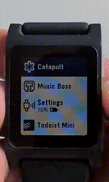

# Catapult for Pebble

A pebble watchapp for interacting with the [Tasker](https://tasker.joaoapps.com/).

# Install

**Note: the old Pebble app is not supported. You have to use either the microPebble or the new Pebble/Core app.**

## Android app

## Watchapp

# Features

#### Launch Tasker tasks from the watch
Launch your favourite tasks directly from your watch

#### Subfolders
Organise your tasks however you want

#### Faaast
List of tasks is cached on the watch, so you don't need to wait for the app to load, you can browse and trigger your tasks immediately

#### Dynamically show/hide actions
You can use Tasker to dynamically show/hide actions from the watch. For example, hide all of your home automation actions when you are not home.

#### Voice input
You can input text into tasks via watch's microphone

#### Timeline pin creation
"Launch" timeline pins from Tasker onto the watch

# Contributing

See [CONTRIBUTING](CONTRIBUTING.MD)